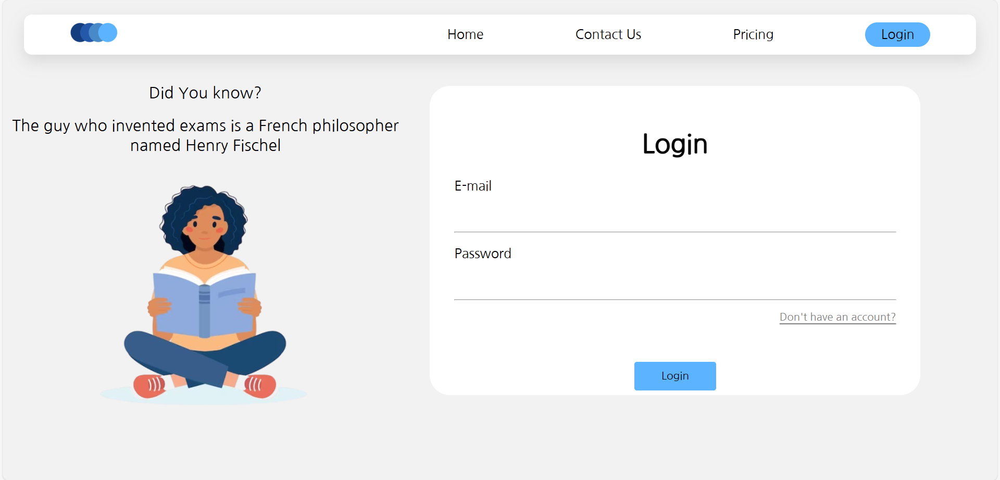
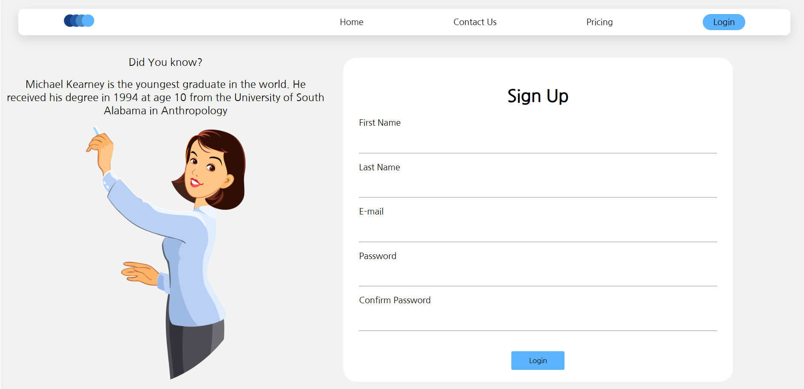
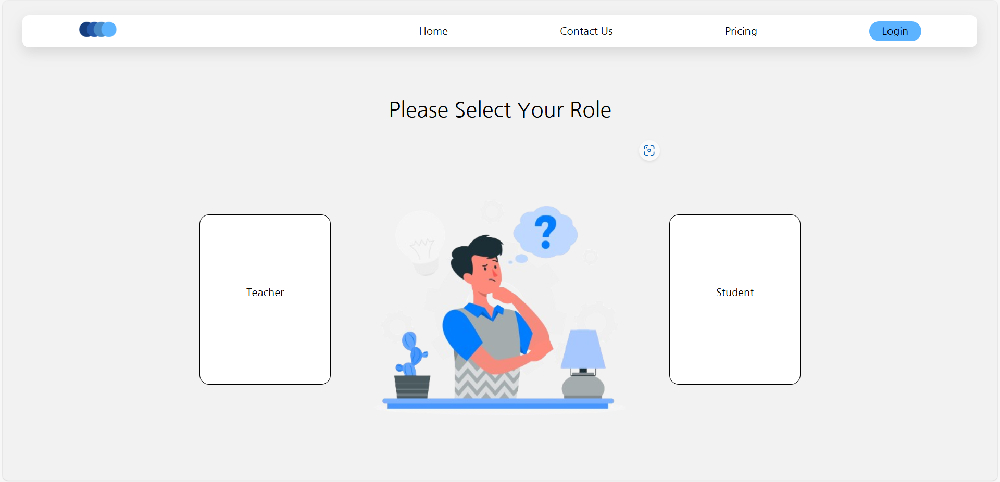

# ExamEase - Online Examination Platform 📚

[](https://firebase.google.com/)
[](https://developer.mozilla.org/en-US/docs/Web/JavaScript)
[](https://developer.mozilla.org/en-US/docs/Learn/CSS/CSS_layout/Responsive_Design)

A modern examination platform with user authentication and management system powered by Firebase.

**Live Demo:** [ExamEase](https://prabhnoor25.github.io/examease)

## Features ✨
- 🔐 Firebase Authentication
- 📱 Responsive Mobile-First Design
- 📊 User Session Management
- 📝 Form Validation
- 🔄 Real-time Database Updates
- 🎨 Interactive UI Components
- 📱 Mobile-Optimized Navigation

## Tech Stack 🛠️
- **Frontend:** HTML5, CSS3, JavaScript
- **Backend:** Firebase Realtime Database
- **Auth:** Firebase Authentication

## Project Structure 📁
```
examease/
├── index.html
├── navbar.css
├── navbar.js
├── styles.css
├── images/
│   ├── logo.png
│   ├── icon.png
│   └── ...other assets
└── pages/
    ├── login/
    │   ├── login.html
    │   ├── login.css
    │   └── login.js
    ├── sign-up/
    │   ├── sign-up.html
    │   ├── sign-up.css
    │   └── sign-up.js
    ├── contact-us.html
    └── pricing.html
```

## Installation 💻
1. Clone repository:
```bash
git clone https://github.com/prabhnoor25/examease.git
```
2. Open in browser:
```bash
open index.html
```

## Screenshots 📸

**Login Page** 



**Signup Page**  



**Select Role**  



**Dashboard** 


## Database Schema 🗃️
```json
{
  "users": {
    "userATexampleDOTcom": {
      "name": {
        "fName": "John",
        "lName": "Doe"
      },
      "email": "user@example.com",
      "pwd": "password123"
    }
  }
}
```

## License 📄
This project is licensed under the [MIT License](/LICENSE)

---

**Developed with ❤️ by Prabhnoor Singh**  

[](https://github.com/prabhnoor25/examease)
